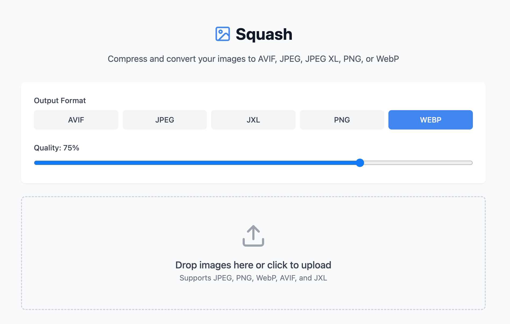

# Squash 🎨 [](https://github.com/nicholasadamou/squash/actions/workflows/tests.yml)




A modern, browser-based image compression tool that leverages WebAssembly for high-performance image optimization. Squish supports multiple formats and provides an intuitive interface for compressing your images without compromising quality.

## ✨ Features

- 🖼️ Support for multiple image formats:
  - AVIF (AV1 Image Format)
  - JPEG (using MozJPEG)
  - JPEG XL
  - PNG (using OxiPNG)
  - WebP

- 🚀 Key capabilities:
  - Browser-based compression (no server uploads needed)
  - Batch processing support
  - Format conversion
  - Quality adjustment per format
  - Real-time preview
  - Size reduction statistics
  - Drag and drop interface
  - Smart queue for compressing large number of files

## 🛠️ Technology

Squish is built with modern web technologies:

- React + TypeScript for the UI
- Vite for blazing fast development
- WebAssembly for native-speed image processing
- Tailwind CSS for styling
- jSquash for image codec implementations
- Jest for testing
- GitHub Actions for CI/CD
- Framer Motion for animations

## 🚀 Getting Started

### Prerequisites

- Node.js 18 or later
- pnpm 10.x or later

### Installation

1. Clone the repository:
```bash
git clone https://github.com/nicholasadamou/squash.git
cd squash
```

2. Install dependencies:
```bash
pnpm install
```

3. Start the development server:
```bash
pnpm run dev
```

4. Run the tests:
```bash
pnpm test
```

5. Build for production:
```bash
pnpm run build
```

## 💡 Usage

1. **Drop or Select Images**: Drag and drop images onto the upload area or click to select files
2. **Choose Output Format**: Select your desired output format (AVIF, JPEG, JPEG XL, PNG, or WebP)
3. **Adjust Quality**: Use the quality slider to balance between file size and image quality
4. **Download**: Download individual images or use the "Download All" button for batch downloads

## 🔧 Default Quality Settings

- AVIF: 50%
- JPEG: 75%
- JPEG XL: 75%
- PNG: Lossless
- WebP: 75%

## 🙏 Acknowledgments

- [jSquash](https://github.com/jamsinclair/jSquash) for the WebAssembly image codecs
- [MozJPEG](https://github.com/mozilla/mozjpeg) for JPEG compression
- [libavif](https://github.com/AOMediaCodec/libavif) for AVIF support
- [libjxl](https://github.com/libjxl/libjxl) for JPEG XL support
- [Oxipng](https://github.com/shssoichiro/oxipng) for PNG optimization
