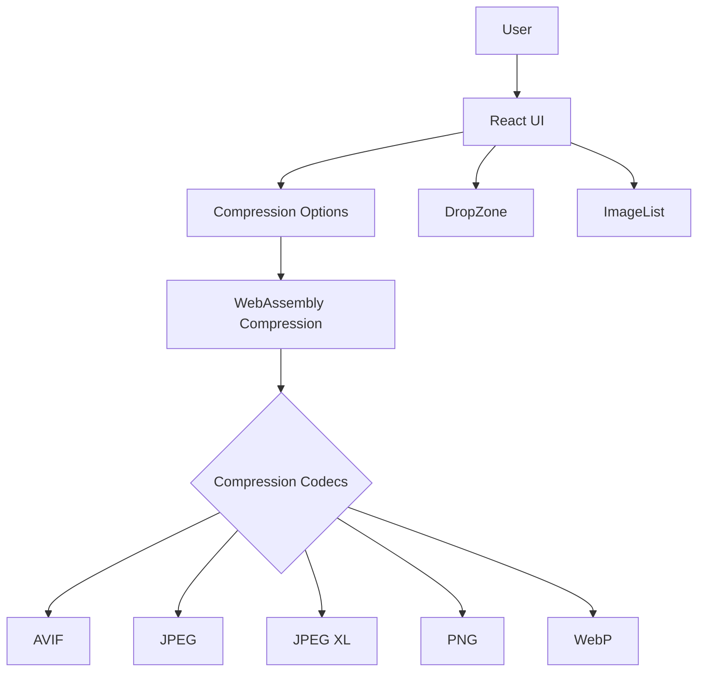
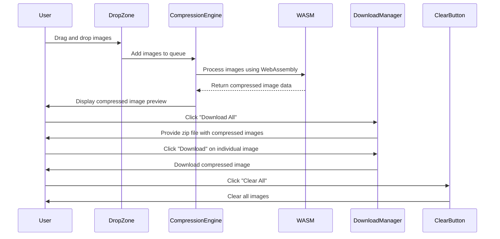
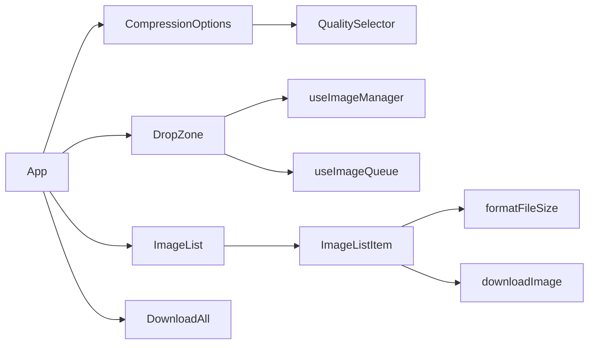
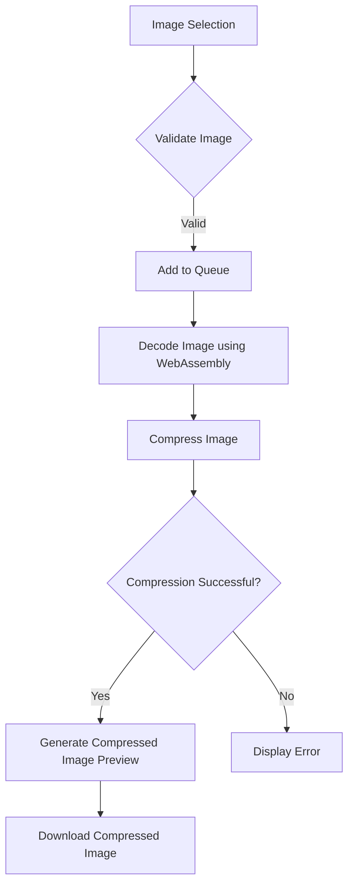
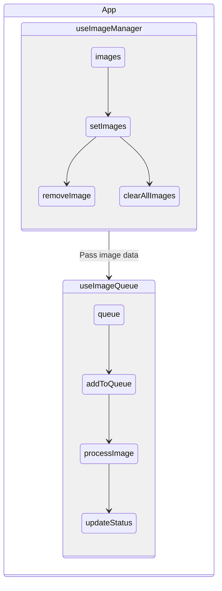
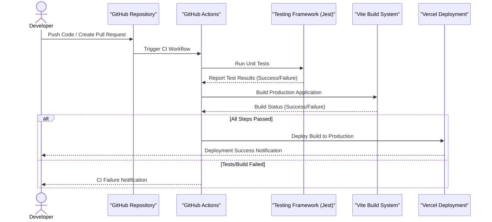

# Squash 🎨 [](https://github.com/nicholasadamou/squash/actions/workflows/tests.yml)


Squash is a modern, browser-based image compression tool that leverages **WebAssembly** for high-performance image optimization. It supports multiple image formats and provides an intuitive interface for compressing images without compromising quality.

📖 Read the [project overview](https://www.nicholasadamou.com/projects/squash) for more details.

## ✨ Features

- 🖼️ **Multiple Image Format Support**: AVIF, JPEG (MozJPEG), JPEG XL, PNG (OxiPNG), WebP
- 🚀 **High-performance Compression**: Powered by WebAssembly codecs
- 🗂️ **Batch Processing**: Process multiple images at once
- 🔄 **Real-time Preview and Format Conversion**
- 📉 **Size Reduction Statistics**
- 📥 **Drag & Drop Interface** with Smart Queue for large files

## 🛠️ Technology Stack

- **React + TypeScript**: For the user interface
- **Vite**: For fast development and builds
- **WebAssembly**: For native-speed image processing
- **Tailwind CSS**: For styling
- **jSquash**: For image codec implementations
- **Framer Motion**: For animations
- **GitHub Actions**: For CI/CD
- **Jest**: For testing

## 📚 Architecture

Squash is built with a modular architecture that allows for easy addition of new image codecs and optimization tools. The core components are:



The **WebAssembly Compression Module** handles the loading and initialization of codecs. Each codec provides a common interface for image compression. The **React UI** manages user interactions and displays compressed images.

---

## 🛠️ Workflow Diagram



## 🔧 Component Interaction



The `App` component serves as the main entry point, containing several child components:

- **CompressionOptions**: Manages output format and quality settings.
- **DropZone**: Handles drag-and-drop image uploads and queues images.
- **ImageList**: Displays a list of images.
- **DownloadAll**: Provides batch download functionality.

## 🔄 How Images Are Compressed



If an image is valid, it is added to the queue. The **WebAssembly module** decodes and compresses the image using the selected codec. If successful, a preview is generated, and the user can download the compressed image.

## 📊 State Management



State management is handled through custom hooks:

- **useImageManager**: Manages image state (add, remove, clear).
- **useImageQueue**: Manages image compression queue and processing.

## 📦 CI/CD with GitHub Actions and Vercel

**Squash** uses a **CI/CD pipeline** powered by **GitHub Actions** for continuous integration and **Vercel** for seamless deployment. This combination ensures that every change is automatically tested and deployed to production without manual intervention, promoting an efficient and reliable development workflow.

### CI/CD Pipeline Workflow



### 🛠️ How the Workflow Operates

1. **Developer Pushes Code / Creates Pull Request**
   The workflow is automatically triggered on every code push or pull request to the `main` branch.

2. **GitHub Actions CI Process**
   GitHub Actions orchestrates a multi-step process to validate the changes:
- **Dependency Installation**: Dependencies are installed using **pnpm**, ensuring faster and more efficient builds.
- **Run Unit Tests**: **Jest** tests all components and modules to validate functionality.
- **Build Production Application**: **Vite** compiles the application to ensure it can be successfully built for production.

3. **Conditional Check**
   If all steps pass, the application is deployed to **Vercel**.

4. **Automatic Deployment with Vercel**
   Vercel takes the production build and deploys it to its global content delivery network (CDN), providing instant access to the new version.
- **Preview Deployments**: A unique preview URL is generated for each pull request, enabling easy testing and collaboration.
- **Production Deployment**: Once changes are merged, the application is deployed to production.

5. **Notifications**
- If all steps pass, the developer receives a **deployment success** notification.
- If any step fails (tests, build, or deployment), GitHub Actions sends a **failure notification** with detailed logs for debugging.

The GitHub Actions workflow (`.github/workflows/tests.yml`):

```yaml
name: Run Tests

on:
    push:
        branches: [ main, master ]
    pull_request:
        branches: [ main, master ]

jobs:
    test:
        runs-on: ubuntu-latest

        steps:
            - uses: actions/checkout@v4

            - name: Set up Node.js
              uses: actions/setup-node@v4
              with:
                  node-version: '20'

            - name: Install pnpm
              uses: pnpm/action-setup@v2
              with:
                  version: 10

            - name: Get pnpm store directory
              shell: bash
              run: |
                  echo "STORE_PATH=$(pnpm store path --silent)" >> $GITHUB_ENV

            - name: Setup pnpm cache
              uses: actions/cache@v4
              with:
                  path: ${{ env.STORE_PATH }}
                  key: ${{ runner.os }}-pnpm-store-${{ hashFiles('**/package.json') }}
                  restore-keys: |
                      ${{ runner.os }}-pnpm-store-

            - name: Install dependencies
              run: pnpm install --no-frozen-lockfile

            - name: Run tests
              run: pnpm test
   ```

3. **Vercel for Continuous Deployment**
   Once the tests pass successfully, **Vercel** handles the deployment of the application. Vercel provides:
- **Automatic Preview Deployments**: Every pull request is deployed to a unique preview URL, allowing for easy review and testing.
- **Instant Rollbacks**: In case of an error in the production build, it’s easy to roll back to a previous deployment.
- **Optimized Build and Delivery**: Vercel optimizes the production build for speed and scalability, ensuring that Squash is always served efficiently.

### 💡 Benefits of This Setup

1. **Fully Automated Workflow**
   Every change is tested, built, and deployed automatically, ensuring quick feedback and reducing the chance of introducing bugs into production.

2. **Collaborative Review**
   Preview deployments allow stakeholders and collaborators to test and review features before they are merged into the main branch.

3. **Scalability and Performance**
   With Vercel’s edge network, the Squash application is served globally with low latency, providing a fast and seamless user experience.

## 🛠️ Getting Started

### Prerequisites
- Node.js 18 or later
- pnpm 10.x or later

### Installation

1. Clone the repository:
   ```bash
   git clone https://github.com/nicholasadamou/squash.git
   cd squash
   ```

2. Install dependencies:
   ```bash
   pnpm install
   ```

3. Start the development server:
   ```bash
   pnpm run dev
   ```

## 💡 Usage

1. **Drag and Drop Images**: Upload images by dragging and dropping them into the DropZone.
2. **Select Output Format**: Choose between AVIF, JPEG, JPEG XL, PNG, and WebP.
3. **Adjust Quality**: Use the quality slider for optimal compression.
4. **Download**: Download individual images or all at once.

## 🔧 Default Quality Settings

- AVIF: 50%
- JPEG: 75%
- JPEG XL: 75%
- PNG: Lossless
- WebP: 75%

## 🙏 Acknowledgments

- [jSquash](https://github.com/jamsinclair/jSquash) for the WebAssembly image codecs
- [MozJPEG](https://github.com/mozilla/mozjpeg) for JPEG compression
- [libavif](https://github.com/AOMediaCodec/libavif) for AVIF support
- [libjxl](https://github.com/libjxl/libjxl) for JPEG XL support
- [Oxipng](https://github.com/shssoichiro/oxipng) for PNG optimization

