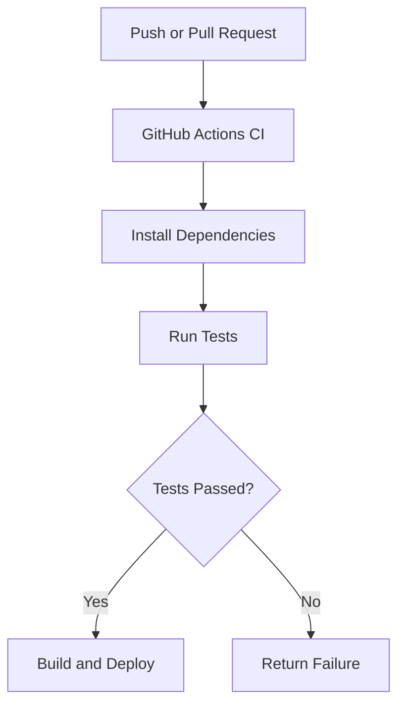

# Squash 🎨 [](https://github.com/nicholasadamou/squash/actions/workflows/tests.yml)


Squash is a modern, browser-based image compression tool that leverages **WebAssembly** for high-performance image optimization. It supports multiple image formats and provides an intuitive interface for compressing images without compromising quality.

---

## ✨ Features

- 🖼️ **Multiple Image Format Support**: AVIF, JPEG (MozJPEG), JPEG XL, PNG (OxiPNG), WebP
- 🚀 **High-performance Compression**: Powered by WebAssembly codecs
- 🗂️ **Batch Processing**: Process multiple images at once
- 🔄 **Real-time Preview and Format Conversion**
- 📉 **Size Reduction Statistics**
- 📥 **Drag & Drop Interface** with Smart Queue for large files

---

## 🛠️ Technology Stack

- **React + TypeScript**: For the user interface
- **Vite**: For fast development and builds
- **WebAssembly**: For native-speed image processing
- **Tailwind CSS**: For styling
- **jSquash**: For image codec implementations
- **Framer Motion**: For animations
- **GitHub Actions**: For CI/CD
- **Jest**: For testing

---

## 📚 Architecture

Squash is built with a modular architecture that allows for easy addition of new image codecs and optimization tools. The core components are:


The **WebAssembly Compression Module** handles the loading and initialization of codecs. Each codec provides a common interface for image compression. The **React UI** manages user interactions and displays compressed images.

---

## 🛠️ Workflow Diagram


---

## 🔧 Component Interaction


The `App` component serves as the main entry point, containing several child components:

- **CompressionOptions**: Manages output format and quality settings.
- **DropZone**: Handles drag-and-drop image uploads and queues images.
- **ImageList**: Displays a list of images.
- **DownloadAll**: Provides batch download functionality.

---

## 🔄 How Images Are Compressed


If an image is valid, it is added to the queue. The **WebAssembly module** decodes and compresses the image using the selected codec. If successful, a preview is generated, and the user can download the compressed image.

---

## 📊 State Management


State management is handled through custom hooks:

- **useImageManager**: Manages image state (add, remove, clear).
- **useImageQueue**: Manages image compression queue and processing.

---

## 📦 CI/CD Workflow



GitHub Actions ensures continuous integration and deployment by running tests and deploying the application on successful builds.

---

## 🛠️ Getting Started

### Prerequisites
- Node.js 18 or later
- pnpm 10.x or later

### Installation

1. Clone the repository:
   ```bash
   git clone https://github.com/nicholasadamou/squash.git
   cd squash
   ```

2. Install dependencies:
   ```bash
   pnpm install
   ```

3. Start the development server:
   ```bash
   pnpm run dev
   ```

---

## 💡 Usage

1. **Drag and Drop Images**: Upload images by dragging and dropping them into the DropZone.
2. **Select Output Format**: Choose between AVIF, JPEG, JPEG XL, PNG, and WebP.
3. **Adjust Quality**: Use the quality slider for optimal compression.
4. **Download**: Download individual images or all at once.

## 🔧 Default Quality Settings

- AVIF: 50%
- JPEG: 75%
- JPEG XL: 75%
- PNG: Lossless
- WebP: 75%

## 🙏 Acknowledgments

- [jSquash](https://github.com/jamsinclair/jSquash) for the WebAssembly image codecs
- [MozJPEG](https://github.com/mozilla/mozjpeg) for JPEG compression
- [libavif](https://github.com/AOMediaCodec/libavif) for AVIF support
- [libjxl](https://github.com/libjxl/libjxl) for JPEG XL support
- [Oxipng](https://github.com/shssoichiro/oxipng) for PNG optimization

