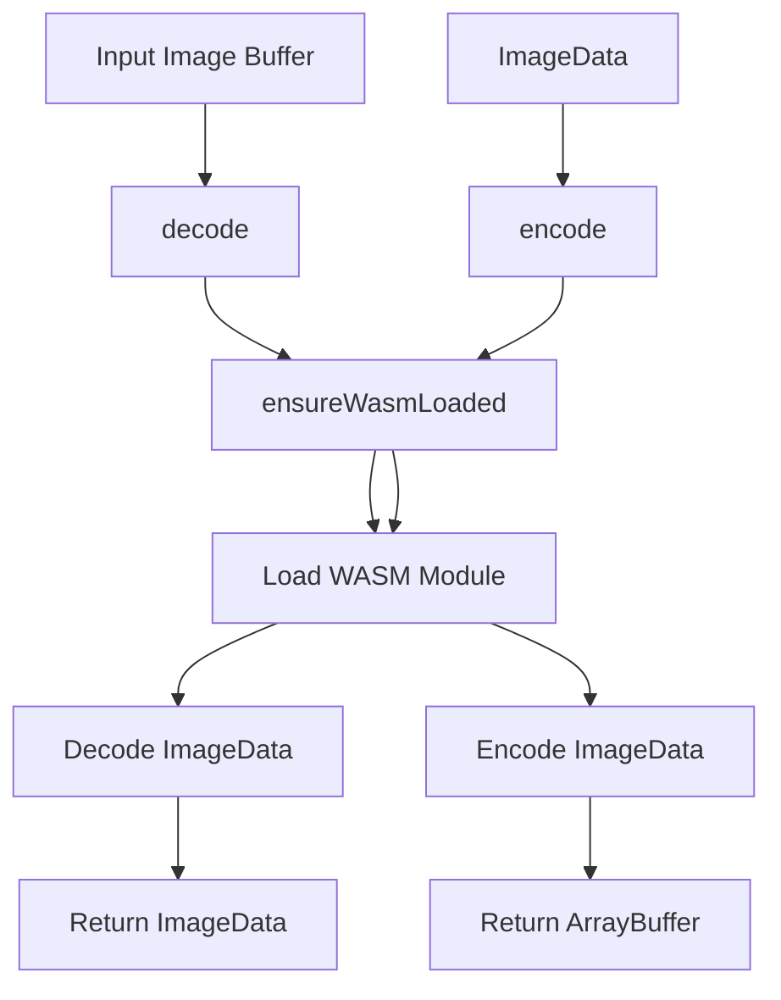

# 📦 _Decoders_ Image Processing with 

The **decoders** package in Squash handles the encoding and decoding of images using high-performance WebAssembly (WASM) modules. It supports multiple image formats like **AVIF, JPEG, JPEG XL, PNG, and WebP**, providing fast and efficient image processing.

This package ensures the necessary WebAssembly modules are dynamically loaded and cached for reuse, optimizing performance and memory usage. It also normalizes input formats for consistency.

## ✨ Features

- **Dynamic WebAssembly Loading**: Loads only the required WebAssembly module for the given format.
- **Caching for Performance**: Uses an in-memory cache to avoid redundant WebAssembly loads.
- **Error Handling & Fallbacks**: Provides descriptive errors when a format is unsupported or a decoding/encoding process fails.
- **Supports Multiple Formats**: AVIF, JPEG (MozJPEG), JPEG XL, PNG (OxiPNG), and WebP.
- **Common Interface for Decoding and Encoding**: Ensures consistency across all image formats.

## 📚 Architecture Overview



## 🔍 Code Walkthrough

### 1. `wasm.ts` — Dynamic WebAssembly Loader

The `wasm.ts` file provides the core functionality for loading WebAssembly modules dynamically and caching them for subsequent use.

### **Key Functions**:

#### **`resetWasmState()`**
Resets the WebAssembly state by clearing the internal cache. This is useful for reinitializing modules if needed.

```typescript
export function resetWasmState() {
  wasmInitialized.clear();
}
```

#### **`normalizeFormat()`**
Normalizes input formats to ensure consistent handling. For example, `jpg` is converted to `jpeg`.

```typescript
function normalizeFormat(format: string): OutputType {
  if (format === 'jpg') return 'jpeg';
  return format as OutputType;
}
```

#### **`importModule()`**
Dynamically imports a WebAssembly module using the specified format and caches it.

```typescript
async function importModule(module: string): Promise<unknown> {
  if (moduleCache.has(module)) {
    return moduleCache.get(module);
  }

  const loadModule = wasmModuleMap[module];
  if (!loadModule) {
    throw new Error(`Module "${module}" is not available.`);
  }

  const importPromise = loadModule();
  moduleCache.set(module, importPromise);

  try {
    return await importPromise;
  } catch (error) {
    moduleCache.delete(module);
    throw new Error(`Failed to load module "${module}". ${error instanceof Error ? error.message : ''}`);
  }
}
```

#### **`ensureWasmLoaded()`**
Ensures that the WebAssembly module for the given format is loaded. If the module is already loaded, it skips reloading.

```typescript
export async function ensureWasmLoaded(format: string): Promise<void> {
  const normalizedFormat = normalizeFormat(format);
  if (wasmInitialized.get(normalizedFormat)) return;

  const wasmModules: Record<OutputType, () => Promise<unknown>> = {
    avif: async () => importModule('@jsquash/avif'),
    jpeg: async () => importModule('@jsquash/jpeg'),
    jxl: async () => importModule('@jsquash/jxl'),
    png: async () => importModule('@jsquash/png'),
    webp: async () => importModule('@jsquash/webp'),
  };

  const loadWasm = wasmModules[normalizedFormat];
  if (!loadWasm) {
    throw new Error(`Unsupported format: ${format}`);
  }

  await loadWasm();
  wasmInitialized.set(normalizedFormat, true);
}
```

### 2. `index.ts` — Encoding and Decoding Functions

The `index.ts` file provides the main functions for decoding and encoding images.

### **Key Functions**:

#### **`decode()`**
Decodes an image buffer to `ImageData` based on the specified source type.

```typescript
export async function decode(sourceType: string, fileBuffer: ArrayBuffer): Promise<ImageData> {
  await ensureWasmLoaded(sourceType as OutputType);

  const decoders = {
    avif: avif.decode,
    jpeg: jpeg.decode,
    jpg: jpeg.decode,
    jxl: jxl.decode,
    png: png.decode,
    webp: webp.decode,
  };

  if (!isDecoderType(sourceType)) {
    throw new Error(`Unsupported source type: ${sourceType}`);
  }

  return await decoders[sourceType](fileBuffer);
}
```

#### **`encode()`**
Encodes `ImageData` to a specified output format and returns the result as an `ArrayBuffer`.

```typescript
export async function encode<T extends OutputType>(
  outputType: T,
  imageData: ImageData,
  options: JpegEncodeOptions | JxlEncodeOptions | WebpEncodeOptions
): Promise<ArrayBuffer> {
  await ensureWasmLoaded(outputType);

  switch (outputType) {
    case 'avif':
      return await avif.encode(imageData);
    case 'jpeg':
      return await jpeg.encode(imageData, options as JpegEncodeOptions);
    case 'jxl':
      return await jxl.encode(imageData, options as JxlEncodeOptions);
    case 'png':
      return await png.encode(imageData);
    case 'webp':
      return await webp.encode(imageData, options as WebpEncodeOptions);
    default:
      throw new Error(`Unsupported output type: ${outputType}`);
  }
}
```

## 📦 Supported Image Formats

| Format   | Decoder Module | Encoder Module | Notes                      |
|----------|----------------|----------------|----------------------------|
| AVIF     | `@jsquash/avif` | `@jsquash/avif` | High compression, modern format |
| JPEG     | `@jsquash/jpeg` | `@jsquash/jpeg` | Widely used format          |
| JPEG XL  | `@jsquash/jxl`  | `@jsquash/jxl`  | Next-gen format, lossless support |
| PNG      | `@jsquash/png`  | `@jsquash/png`  | Lossless compression        |
| WebP     | `@jsquash/webp` | `@jsquash/webp` | Better compression than JPEG |

## 🛠️ Error Handling & Debugging

- **Unsupported Formats**: Throws an error if a format is not supported.
- **Failed Module Loading**: Provides detailed error messages when a WebAssembly module fails to load.
- **Console Logging**: Use the `verbose` option in `ensureWasmLoaded` for detailed logs.

## 🚀 Usage

```typescript
import { decode, encode } from './decoders';
import type { OutputType } from './types';

const fileBuffer = ...; // Load your image buffer here
const outputType: OutputType = 'jpeg';

const imageData = await decode('png', fileBuffer);
const encodedBuffer = await encode(outputType, imageData, { quality: 75 });
```

## 🛡️ Best Practices

1. **Cache WebAssembly Modules**: Always cache loaded modules to reduce overhead.
2. **Normalize Formats**: Use `normalizeFormat()` to ensure consistent handling.
3. **Error Handling**: Ensure that your application handles decoding and encoding errors gracefully.
4. **Quality Settings**: Adjust quality settings for a balance between size and image fidelity.
