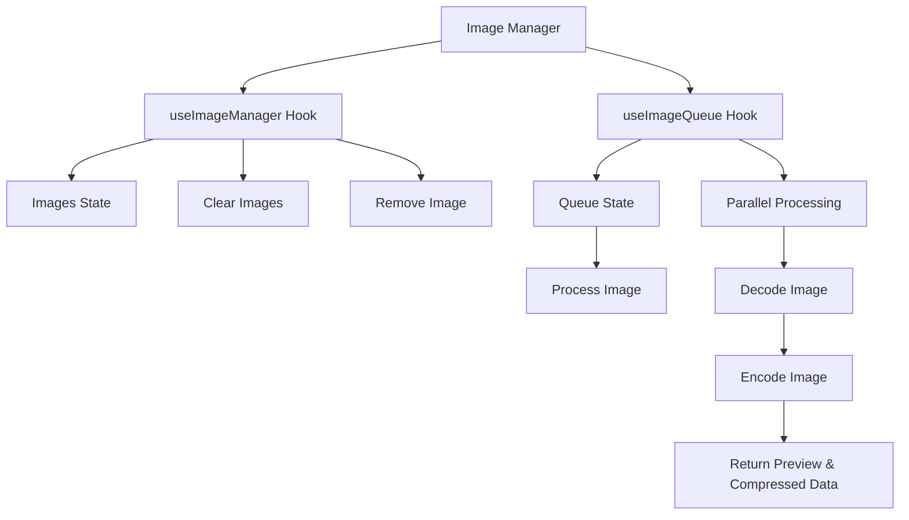

# 🔄 Image Manager and Queue Hooks

The **`useImageManager`** and **`useImageQueue`** hooks in Squash handle the lifecycle of images being processed for compression. Together, they manage image states, queues, parallel processing, and memory cleanup, ensuring a seamless and performant user experience.

## ✨ Features

- **State Management**: Tracks the lifecycle of images, including statuses like pending, queued, processing, complete, and error.
- **Batch Queueing**: Adds images to a queue for efficient processing with parallelism.
- **Parallel Processing**: Processes up to 3 images concurrently to balance performance and responsiveness.
- **Memory Management**: Cleans up `ObjectURL` previews when images are removed or cleared.
- **Error Handling**: Tracks and reports errors for individual images during processing.

## 📚 Architecture Overview



## 🔍 Code Walkthrough

### 1. **`useImageManager`** — Core Image State Management

The `useImageManager` hook is responsible for managing the state of images throughout their lifecycle, including adding, removing, and clearing images.

### **Key Functions**:

#### **`setImages`**
Adds or updates the list of images in the state.

```typescript
const [images, setImages] = useState<ImageFile[]>([]);
```

#### **`removeImage`**
Removes an image by its `id` and revokes the preview URL to free up memory.

```typescript
const removeImage = useCallback((id: string) => {
    setImages((prev) => {
        const imageToRemove = prev.find((img) => img.id === id);
        if (imageToRemove?.preview) {
            URL.revokeObjectURL(imageToRemove.preview);
        }
        return prev.filter((img) => img.id !== id);
    });
}, []);
```

#### **`clearAllImages`**
Clears all images and revokes their preview URLs.

```typescript
const clearAllImages = useCallback(() => {
    setImages((prev) => {
        prev.forEach((image) => {
            if (image.preview) {
                URL.revokeObjectURL(image.preview);
            }
        });
        return [];
    });
}, []);
```

#### **`completedImages`**
Counts the number of images with a `complete` status.

```typescript
const completedImages = useMemo(() => {
    return images.filter((img) => img.status === 'complete').length;
}, [images]);
```

### 2. **`useImageQueue`** — Managing Image Processing

The `useImageQueue` hook handles the queuing and processing of images for compression. It leverages parallel processing and ensures efficient resource usage.

### **Key Features**:

#### **Parallel Processing**
Limits the number of concurrent image processing tasks to `MAX_PARALLEL_PROCESSING` (default: 3) to balance performance.

```typescript
const MAX_PARALLEL_PROCESSING = 3;
const processingCount = useRef(0);
const processingImages = useRef(new Set<string>());
```

### **Key Functions**:

#### **`addToQueue`**
Adds an image to the processing queue.

```typescript
const addToQueue = useCallback((imageId: string) => {
    if (!queue.includes(imageId)) {
        setQueue((prev) => [...prev, imageId]);
    }
}, [queue]);
```

#### **`processNextInQueue`**
Processes the next batch of images from the queue.

```typescript
const processNextInQueue = useCallback(() => {
    if (processingCount.current >= MAX_PARALLEL_PROCESSING || queue.length === 0) return;

    setImages((prev) => {
        const imagesToProcess = prev.filter(
            (img) =>
                queue.includes(img.id) &&
                !processingImages.current.has(img.id) &&
                processingCount.current < MAX_PARALLEL_PROCESSING
        );

        imagesToProcess.forEach((image, index) => {
            setTimeout(() => processImage(image), index * 100);
        });

        setQueue((current) => current.filter((id) => !imagesToProcess.some((img) => img.id === id)));

        return prev.map((img) =>
            imagesToProcess.some((processImg) => processImg.id === img.id)
                ? { ...img, status: 'queued' }
                : img
        );
    });
}, [queue, processImage, setImages]);
```

#### **`processImage`**
Handles the decoding, encoding, and updating of an image’s state during processing.

```typescript
const processImage = useCallback(async (image: ImageFile) => {
    if (processingImages.current.has(image.id)) return;

    processingImages.current.add(image.id);
    processingCount.current++;

    markImageStatus(image.id, 'processing');

    try {
        const fileBuffer = await image.file.arrayBuffer();
        const sourceType = getFileType(image.file);
        const imageData = await decode(sourceType, fileBuffer);
        const compressedBuffer = await encode(outputType, imageData, options);

        const blob = new Blob([compressedBuffer], { type: `image/${outputType}` });
        const preview = URL.createObjectURL(blob);

        markImageStatus(image.id, 'complete', {
            preview,
            blob,
            compressedSize: compressedBuffer.byteLength,
            outputType,
        });
    } catch (error) {
        console.error('Error processing image:', error);
        markImageStatus(image.id, 'error', {
            error: error instanceof Error ? error.message : 'Failed to process image',
        });
    } finally {
        processingImages.current.delete(image.id);
        processingCount.current--;
        processNextInQueue();
    }
}, [options, outputType, markImageStatus]);
```

#### **`markImageStatus`**
Updates the state of a specific image during its lifecycle.

```typescript
const markImageStatus = useCallback(
    (imageId: string, status: 'processing' | 'complete' | 'error', extraData = {}) => {
        setImages((prev) =>
            prev.map((img) =>
                img.id === imageId
                    ? { ...img, status, ...extraData }
                    : img
            )
        );
    },
    [setImages]
);
```

## 📦 Image States

| State      | Description                                  |
|------------|----------------------------------------------|
| `pending`  | The image is added but not yet queued.       |
| `queued`   | The image is queued for processing.          |
| `processing` | The image is currently being processed.   |
| `complete` | The image has been successfully processed.   |
| `error`    | An error occurred while processing the image.|

## 🚀 Usage

### Using the Hooks Together

```typescript
import { useImageManager } from './hooks/useImageManager';
import { useImageQueue } from './hooks/useImageQueue';

const { images, setImages, removeImage, clearAllImages, completedImages } = useImageManager();
const { addToQueue } = useImageQueue(
    { quality: 75 },
    'jpeg',
    setImages
);

// Adding an image to the manager and queue
const handleAddImage = (imageFile) => {
    setImages([...images, imageFile]);
    addToQueue(imageFile.id);
};
```

## 🔧 Best Practices

1. **Parallelism**: Limit concurrent processing for performance and memory efficiency.
2. **Error Handling**: Track and handle errors gracefully for individual images.
3. **Memory Management**: Always revoke `ObjectURL` previews when images are removed or cleared.
4. **State Updates**: Use `useCallback` to avoid unnecessary re-renders when managing state.
